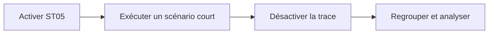

# ANALYSER LES ACCES SQL AVEC ST05

## RÉSULTAT ATTENDU

Tracer précisément les accès SQL exécutés pendant un scénario court et reproductible.

## PROCESS

### ÉTAPE 1 — PRÉPARER DEUX SESSIONS

Dans la première, ouvrir `ST05`; dans la seconde, préparer l’application juste avant l’action lente. Relever utilisateur, mandant, données et heure. Utiliser un utilisateur dédié lorsque possible pour réduire le bruit.

### ÉTAPE 2 — CONFIGURER LA TRACE SQL

Sélectionner la trace SQL et limiter le périmètre à l’utilisateur ou au contexte autorisé. Vérifier qu’aucune trace concurrente incompatible n’est active. Ne pas lancer une trace globale prolongée sans coordination Basis.

### ÉTAPE 3 — ACTIVER, EXÉCUTER, DÉSACTIVER

Activer immédiatement avant l’action, reproduire une seule fois puis désactiver sans attendre. Noter l’horodatage. Si le scénario échoue, conserver l’état fonctionnel exact qui correspond à la trace.

### ÉTAPE 4 — FILTRER ET REGROUPER

Afficher la trace, limiter à l’intervalle et regrouper les instructions identiques. Trier par temps cumulé, temps moyen, exécutions et lignes. Identifier la source ABAP des entrées dominantes.

### ÉTAPE 5 — ANALYSER L’ACCÈS

Examiner prédicats, valeurs, cardinalité et plan lorsque disponible. Rechercher SQL en boucle, sélection trop large, conversion empêchant un accès efficace ou index inadapté. Ne pas conclure sur le seul temps d’une exécution isolée.

### ÉTAPE 6 — REJOUER APRÈS CORRECTION

Tracer le même scénario avec le même volume. Comparer nombre d’instructions, lignes et temps cumulé. Supprimer les traces inutiles selon les règles du système et conserver uniquement les preuves nécessaires.

## Informations à examiner

- durée totale et moyenne ;
- nombre d’exécutions ;
- lignes retournées ;
- paramètres transmis ;
- source ABAP appelante ;
- plan d’exécution lorsque disponible.

## Signaux fréquents

| Signal                           | Hypothèse                      |
| -------------------------------- | ------------------------------ |
| même requête répétée             | SQL dans une boucle            |
| beaucoup de lignes retournées    | filtre insuffisant             |
| temps moyen élevé                | plan d’accès ou volumétrie     |
| nombreuses requêtes très courtes | coût cumulé des allers-retours |



## Discipline d’utilisation

La trace peut capturer des données techniques sensibles et produire un volume important. Cibler l’utilisateur, limiter la durée et désactiver la trace immédiatement après le scénario. Ne pas lancer une trace globale prolongée sans coordination avec l’administration.

## Après correction

Répéter exactement le même scénario et comparer le nombre d’accès, le temps cumulé et le volume retourné.

## Références SAP officielles

- [SAP Help Portal — SQL Trace Analysis](https://help.sap.com/docs/ABAP_PLATFORM_NEW/ba879a6e2ea04d9bb94c7ccd7cdac446/d1801f89454211d189710000e8322d00.html)
- [SAP Help Portal — ABAP Performance and Tuning](https://help.sap.com/docs/SUPPORT_CONTENT/ABAP/3353523595.html)

## VÉRIFICATION

- Le scénario reproduit correspond au même utilisateur, mandant, transaction et jeu de données.
- L’horodatage et l’identifiant de l’analyse sont conservés.
- La cause retenue est soutenue par une ligne source, une trace ou une valeur observée.
- Après correction, le même scénario ne reproduit plus le défaut et le résultat métier reste identique.

## ERREURS FRÉQUENTES

- Optimiser sans mesure de référence.
- Accepter un finding critique sans correction ni justification formelle.

## FICHE DE CONTRÔLE À COPIER

```text
Système / SID       :
Mandant             :
Utilisateur         :
Transaction / outil :
Objet technique     :
Jeu de données      :
Résultat attendu    :
Résultat observé    :
Horodatage          :
Ordre de transport  :
```

## TERMES DU LEXIQUE

- [ATC](<../🧩 00 ├── LEXIQUE SAP ET ABAP/10 └── ACRONYMES SAP.md#acro-atc>)
- [ABAP](<../🧩 00 ├── LEXIQUE SAP ET ABAP/10 └── ACRONYMES SAP.md#acro-abap>)
- [Trace](<../🧩 00 ├── LEXIQUE SAP ET ABAP/08 ├── EXECUTION EXPLOITATION ET ADMINISTRATION.md#trace>)
