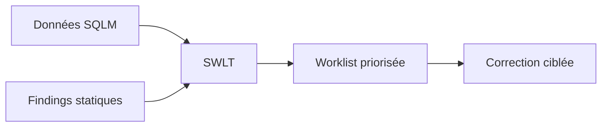

# PRIORISER AVEC SWLT

## RÉSULTAT ATTENDU

Combiner les données d’exécution SQL avec les findings statiques afin de concentrer l’effort sur le code réellement coûteux.

## Principe

`SWLT` rapproche notamment :

- données de runtime issues de `SQLM` ou d’un snapshot ;
- contrôles statiques du Code Inspector ;
- informations sur les objets et tables concernés.



## Utilisation

1. Ouvrir la transaction `SWLT`.
2. Sélectionner le jeu d’objets ou la variante.
3. Choisir les sources de données disponibles.
4. Exécuter la worklist.
5. Trier selon le coût cumulé, la fréquence et la criticité du finding.
6. Naviguer vers le point source.

## Priorisation

Traiter en premier les instructions :

- coûteuses et fréquentes ;
- exécutées dans des processus critiques ;
- associées à un finding statique pertinent ;
- modifiables avec un risque maîtrisé.

## Limites

Une instruction absente de la collecte n’est pas nécessairement inutilisée ; le scénario peut simplement ne pas avoir été exécuté. Les données de runtime doivent couvrir la période métier appropriée, y compris traitements mensuels ou annuels si nécessaire.

## Livrable

Conserver la worklist initiale, la justification du choix, la correction et les mesures après modification.

## Références SAP officielles

- [SAP Help Portal — SQL Performance Tuning Worklist](https://help.sap.com/docs/SAP_NETWEAVER_AS_ABAP_FOR_SOH_740/a24970c68fcf4770a64bf9a78e3719e2/713ff185b9b347aaacbe3ada28d4fa72.html)
- [SAP Help Portal — SQL Monitor](https://help.sap.com/docs/ABAP_PLATFORM_NEW/a24970c68fcf4770a64bf9a78e3719e2/1ec2329419b64f3992a9c342437d3a0f.html)
- [SAP Help Portal — Code Inspector](https://help.sap.com/docs/ABAP_PLATFORM_NEW/ba879a6e2ea04d9bb94c7ccd7cdac446/49205531d0fc14cfe10000000a42189b.html)

## PROCÉDURE PAS À PAS

1. Lire la définition et identifier les prérequis du chapitre.
2. Choisir un objet Z ou un scénario de démonstration sans impact métier.
3. Reproduire l’exemple dans un système de développement et relever les données d’entrée.
4. Contrôler la syntaxe ou la configuration avant activation/exécution.
5. Comparer le résultat observé avec la section **Vérification**.
6. Documenter toute différence liée à la release, aux autorisations ou au paramétrage du système.

## VÉRIFICATION

- Le résultat fonctionnel est identique avant et après optimisation.
- La mesure est répétée avec le même jeu de données et le même contexte.
- Les contrôles statiques ne retournent plus de finding bloquant.
- Les tests automatiques couvrent les cas nominal, limites et erreurs attendues.

## ERREURS FRÉQUENTES

- Optimiser sans mesure de référence.
- Accepter un finding critique sans correction ni justification formelle.

## FICHE DE CONTRÔLE À COPIER

```text
Système / SID       :
Mandant             :
Utilisateur         :
Transaction / outil :
Objet technique     :
Jeu de données      :
Résultat attendu    :
Résultat observé    :
Horodatage          :
Ordre de transport  :
```

## TERMES DU LEXIQUE

- [ATC](<../🧩 00 ├── LEXIQUE SAP ET ABAP/10 └── ACRONYMES SAP.md#acro-atc>)
- [ABAP](<../🧩 00 ├── LEXIQUE SAP ET ABAP/10 └── ACRONYMES SAP.md#acro-abap>)
- [Trace](<../🧩 00 ├── LEXIQUE SAP ET ABAP/08 ├── EXECUTION EXPLOITATION ET ADMINISTRATION.md#trace>)
