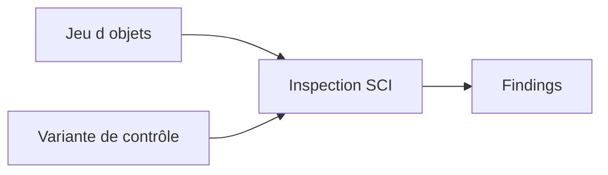

# CODE INSPECTOR AVEC SCI

## RÉSULTAT ATTENDU

Utiliser `SCI` pour exécuter un ensemble cohérent de contrôles sur un objet ou un groupe d’objets Repository.

## Objets principaux

| Objet SCI            | Rôle                                            |
| -------------------- | ----------------------------------------------- |
| Variante de contrôle | règles et paramètres appliqués                  |
| Jeu d’objets         | objets Repository analysés                      |
| Inspection           | association variante + jeu d’objets + résultats |

## Contrôle ad hoc

1. Ouvrir `SCI`.
2. Lancer une inspection ad hoc.
3. Définir les objets ou le package.
4. Choisir une variante globale autorisée.
5. Exécuter et analyser les résultats.



## Domaines de contrôle

Selon la variante : performance, sécurité, robustesse, conventions, syntaxe, recherche de code, objets DDIC, traductions ou dépendances.

## Gouvernance

Une variante locale personnelle n’est pas une référence projet. Pour une validation de livraison, utiliser la variante globale définie par l’équipe qualité ou l’ATC central.

## Relation avec ATC

ATC réutilise l’infrastructure et les contrôles du Code Inspector, tout en ajoutant une gouvernance centralisée des exécutions, résultats, exemptions et transports. SCI reste utile pour construire et comprendre les variantes ainsi que pour les analyses ad hoc.

## Références SAP officielles

- [SAP Help Portal — Code Inspector](https://help.sap.com/docs/ABAP_PLATFORM_NEW/ba879a6e2ea04d9bb94c7ccd7cdac446/49205531d0fc14cfe10000000a42189b.html)
- [SAP Help Portal — Creating Code Inspections](https://help.sap.com/docs/ABAP_PLATFORM_NEW/ba879a6e2ea04d9bb94c7ccd7cdac446/4926dff4c93016b8e10000000a42189d.html)
- [SAP Help Portal — ATC Quality Checking](https://help.sap.com/docs/ABAP_PLATFORM_NEW/c238d694b825421f940829321ffa326a/4ec1a1126e391014adc9fffe4e204223.html)

## PROCESS

### ÉTAPE 1 — CHOISIR LA VARIANTE APPROUVÉE

Saisir `/nSCI` et sélectionner une variante existante correspondant aux règles du projet. Ouvrir sa définition en affichage pour connaître les contrôles et priorités. Ne pas créer une variante plus permissive afin de faire disparaître des findings.

### ÉTAPE 2 — DÉFINIR LE PÉRIMÈTRE D’OBJETS

Créer ou sélectionner une liste d’objets : objet individuel, package, ensemble ou demande selon les possibilités du système. Vérifier que les includes et classes dépendantes livrés sont couverts.

### ÉTAPE 3 — CRÉER L’INSPECTION

Associer la variante et le périmètre, donner un nom explicite puis lancer l’exécution. Conserver la date, l’utilisateur et le périmètre. Éviter de réutiliser une ancienne inspection après modification du code sans la relancer.

### ÉTAPE 4 — ANALYSER LES FINDINGS

Trier par priorité et catégorie. Ouvrir la documentation et naviguer vers la source. Distinguer défaut, risque, dette et message non applicable avec une justification technique vérifiable.

### ÉTAPE 5 — CORRIGER ET EXÉCUTER LES TESTS

Corriger d’abord les findings bloquants, puis relancer les tests ABAP Unit et fonctionnels. Utiliser une exemption ou pseudo-commentaire uniquement selon la gouvernance, avec motif spécifique.

### ÉTAPE 6 — RELANCER L’INSPECTION

Exécuter de nouveau sur le même périmètre et comparer les résultats. Vérifier qu’aucun finding nouveau n’est introduit. Conserver le run final comme preuve de livraison si la procédure du projet l’exige.

## VÉRIFICATION

- Le résultat fonctionnel est identique avant et après optimisation.
- La mesure est répétée avec le même jeu de données et le même contexte.
- Les contrôles statiques ne retournent plus de finding bloquant.
- Les tests automatiques couvrent les cas nominal, limites et erreurs attendues.

## ERREURS FRÉQUENTES

- Optimiser sans mesure de référence.
- Accepter un finding critique sans correction ni justification formelle.

## FICHE DE CONTRÔLE À COPIER

```text
Système / SID       :
Mandant             :
Utilisateur         :
Transaction / outil :
Objet technique     :
Jeu de données      :
Résultat attendu    :
Résultat observé    :
Horodatage          :
Ordre de transport  :
```

## TERMES DU LEXIQUE

- [ATC](<../🧩 00 ├── LEXIQUE SAP ET ABAP/10 └── ACRONYMES SAP.md#acro-atc>)
- [ABAP](<../🧩 00 ├── LEXIQUE SAP ET ABAP/10 └── ACRONYMES SAP.md#acro-abap>)
- [Trace](<../🧩 00 ├── LEXIQUE SAP ET ABAP/08 ├── EXECUTION EXPLOITATION ET ADMINISTRATION.md#trace>)
