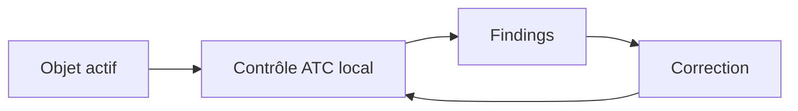

# 15. ABAP TEST COCKPIT AVEC ATC

## 15.A RÉSULTAT ATTENDU

Utiliser l’ATC comme point de contrôle principal de la qualité du code ABAP.

## 15.B Scénarios

- **Contrôle local** : lancé par le développeur sur ses objets.
- **Contrôle central/officiel** : exécuté selon une variante et une planification administrées.
- **Contrôle de transport** : findings évalués lors de la libération selon la configuration du système.

## 15.C Contrôle local dans SAP GUI

Selon la release et l’outil Workbench : ouvrir l’objet, choisir le contrôle ATC, sélectionner la variante autorisée si proposé, exécuter puis ouvrir le résultat.



## 15.D Contenu d’un finding

- priorité ;
- contrôle et message ;
- objet et sous-objet ;
- position source ;
- documentation et proposition de correction lorsque disponibles.

## 15.E Traitement attendu

1. Reproduire le finding sur la version active.
2. Lire la documentation du contrôle.
3. Corriger la cause.
4. Relancer le contrôle local.
5. Vérifier le résultat officiel si un run central existe.

## 15.F Version et configuration

Les variantes, contrôles disponibles, blocages de transport et transactions d’administration dépendent de la release et de la configuration locale. La gouvernance du système fait foi.

## 15.G Références SAP officielles

- [SAP Help Portal — ATC Quality Checking](https://help.sap.com/docs/ABAP_PLATFORM_NEW/c238d694b825421f940829321ffa326a/4ec1a1126e391014adc9fffe4e204223.html)
- [SAP Help Portal — Running Local Quality Checks with ATC](https://help.sap.com/docs/ABAP_PLATFORM_NEW/ba879a6e2ea04d9bb94c7ccd7cdac446/ca5e041535c0491db596d3ca6658cd7d.html)

## 15.H PROCESS

### 15.H.1 ÉTAPE 1 — IDENTIFIER LE MODE ATC DU SYSTÈME

Vérifier si les contrôles sont locaux, centraux ou intégrés aux transports. Relever la variante obligatoire et la version cible. Utiliser l’entrée `ATC` ou l’action de contrôle disponible sur les objets selon la configuration.

### 15.H.2 ÉTAPE 2 — DÉFINIR LE PÉRIMÈTRE

Sélectionner objet, package ou demande contenant tous les développements livrés. Inclure dépendances et objets générés pertinents. Éviter un contrôle limité au seul fichier récemment ouvert.

### 15.H.3 ÉTAPE 3 — LANCER LE RUN

Choisir la variante autorisée, exécuter et conserver l’identifiant, la date et le périmètre. Pour un contrôle central, attendre la fin du run et vérifier la version du code analysée.

### 15.H.4 ÉTAPE 4 — ANALYSER PAR PRIORITÉ

Ouvrir chaque finding, sa documentation et la navigation source. Classer les erreurs bloquantes, les avertissements et les informations selon la gouvernance. Vérifier si le finding porte sur le code Z ou une dépendance non modifiable.

### 15.H.5 ÉTAPE 5 — CORRIGER ET TESTER

Corriger la cause, contrôler la syntaxe et exécuter ABAP Unit ainsi que les tests fonctionnels. Pour une exemption, fournir contexte, preuve de non-applicabilité, propriétaire et échéance. Ne pas utiliser une exemption comme report indéfini.

### 15.H.6 ÉTAPE 6 — RELANCER AVANT LIBÉRATION

Exécuter le même contrôle sur la version finale de la demande. Vérifier le statut des exemptions et l’absence de finding bloquant. Conserver le résultat de référence associé au transport.

## 15.I VÉRIFICATION

- Le résultat fonctionnel est identique avant et après optimisation.
- La mesure est répétée avec le même jeu de données et le même contexte.
- Les contrôles statiques ne retournent plus de finding bloquant.
- Les tests automatiques couvrent les cas nominal, limites et erreurs attendues.

## 15.J ERREURS FRÉQUENTES

- Optimiser sans mesure de référence.
- Accepter un finding critique sans correction ni justification formelle.

## 15.K FICHE DE CONTRÔLE À COPIER

```text
Système / SID       :
Mandant             :
Utilisateur         :
Transaction / outil :
Objet technique     :
Jeu de données      :
Résultat attendu    :
Résultat observé    :
Horodatage          :
Ordre de transport  :
```

## 15.L TERMES DU LEXIQUE

- [ABAP](<../🧩 00 ├── LEXIQUE SAP ET ABAP/10 └── ACRONYMES SAP.md#acro-abap>)
- [ATC](<../🧩 00 ├── LEXIQUE SAP ET ABAP/10 └── ACRONYMES SAP.md#acro-atc>)
- [Trace](<../🧩 00 ├── LEXIQUE SAP ET ABAP/08 ├── EXECUTION EXPLOITATION ET ADMINISTRATION.md#trace>)
