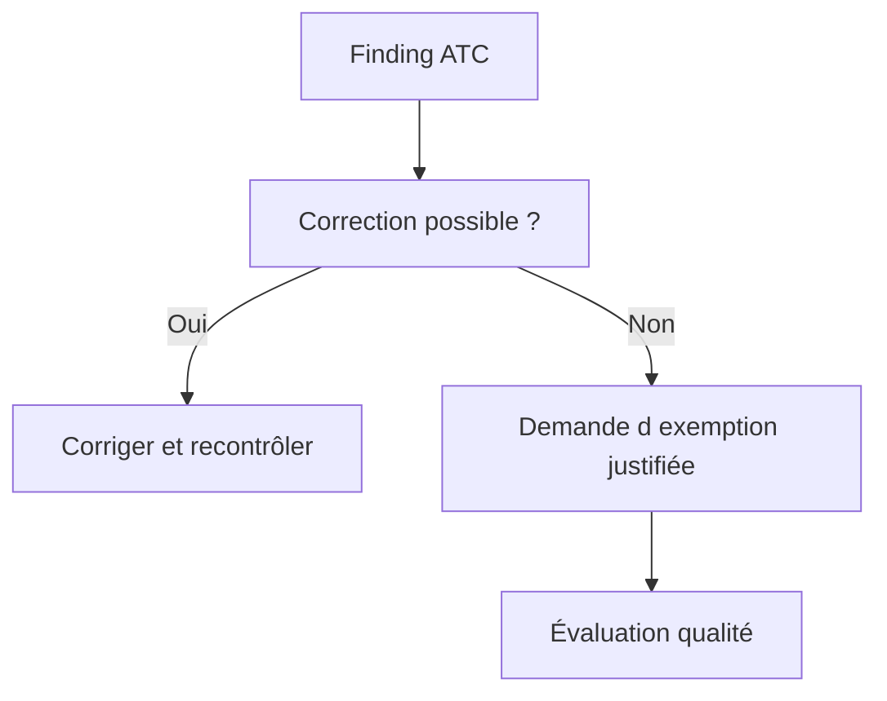

# 16. RESULTATS PRIORITES ET EXEMPTIONS ATC

## 16.A RÉSULTAT ATTENDU

Traiter les findings ATC selon leur priorité et encadrer strictement les exemptions.

## 16.B Priorités

Les findings ATC utilisent des niveaux de priorité. Dans une configuration courante, les priorités 1 et 2 peuvent bloquer la libération des transports, tandis que la priorité 3 est informative ou moins critique. Le comportement exact dépend des réglages du système.

## 16.C Ordre de traitement

1. Findings de sécurité et erreurs potentielles.
2. Incompatibilités de release ou d’API.
3. Défauts de performance avérés.
4. Maintenabilité et conventions.
5. Findings faibles ou contextuels.

## 16.D Exemption

Une exemption n’est pas une suppression arbitraire. Elle doit contenir :

- justification technique précise ;
- périmètre minimal ;
- durée de validité limitée lorsque possible ;
- approbation par le rôle qualité autorisé ;
- référence au risque accepté.



## 16.E Mauvaises pratiques

- pseudo-commentaire sans analyse ;
- exemption sur tout un package alors qu’un sous-objet suffit ;
- validité illimitée par défaut ;
- justification « faux positif » sans démonstration ;
- demandeur et approbateur confondus lorsque la gouvernance l’interdit.

## 16.F Références SAP officielles

- [SAP Help Portal — ATC Quality Checking](https://help.sap.com/docs/ABAP_PLATFORM_NEW/c238d694b825421f940829321ffa326a/4ec1a1126e391014adc9fffe4e204223.html)
- [SAP Help Portal — ATC Exemptions](https://help.sap.com/docs/ABAP_PLATFORM_NEW/ba879a6e2ea04d9bb94c7ccd7cdac446/3a759579e173410caa551e0d428bd7d6.html)

## 16.G PROCESS

### 16.G.1 ÉTAPE 1 — OUVRIR LE RUN EXACT

Relever variante, périmètre, date et version analysée. Ouvrir le résultat ATC correspondant à la dernière exécution, pas un run antérieur. Regrouper les findings par priorité, contrôle et objet.

### 16.G.2 ÉTAPE 2 — COMPRENDRE LA RÈGLE

Lire la documentation, la ligne source et le contexte. Reproduire si le finding dépend d’un type, d’un appel ou d’une donnée. Distinguer une erreur réelle d’un code standard ou généré hors du périmètre de correction.

### 16.G.3 ÉTAPE 3 — CORRIGER LA CAUSE

Modifier le code avec la solution la plus simple respectant la règle. Ajouter ou adapter les tests. Relancer le contrôle sur l’objet pour obtenir un retour rapide, puis sur le périmètre complet.

### 16.G.4 ÉTAPE 4 — PRÉPARER UNE EXEMPTION JUSTIFIÉE

Si la correction est impossible ou non applicable, documenter la raison précise, le risque résiduel, la preuve et l’échéance. Définir le propriétaire qui devra réévaluer la décision. Limiter l’exemption à l’objet et au finding nécessaires.

### 16.G.5 ÉTAPE 5 — SOUMETTRE ET SUIVRE LA DÉCISION

Utiliser le workflow d’exemption configuré. Ne pas considérer la demande comme acceptée avant décision. Vérifier le statut et les conditions posées par l’approbateur.

### 16.G.6 ÉTAPE 6 — RELANCER ET AUDITER

Exécuter ATC sur la version finale et vérifier que les findings corrigés ont disparu et que les exemptions valides sont reconnues. Suivre les échéances ; une exemption expirée redevient un finding à traiter.

## 16.H VÉRIFICATION

- Le résultat fonctionnel est identique avant et après optimisation.
- La mesure est répétée avec le même jeu de données et le même contexte.
- Les contrôles statiques ne retournent plus de finding bloquant.
- Les tests automatiques couvrent les cas nominal, limites et erreurs attendues.

## 16.I ERREURS FRÉQUENTES

- Optimiser sans mesure de référence.
- Accepter un finding critique sans correction ni justification formelle.

## 16.J FICHE DE CONTRÔLE À COPIER

```text
Système / SID       :
Mandant             :
Utilisateur         :
Transaction / outil :
Objet technique     :
Jeu de données      :
Résultat attendu    :
Résultat observé    :
Horodatage          :
Ordre de transport  :
```

## 16.K TERMES DU LEXIQUE

- [ATC](<../🧩 00 ├── LEXIQUE SAP ET ABAP/10 └── ACRONYMES SAP.md#acro-atc>)
- [ABAP](<../🧩 00 ├── LEXIQUE SAP ET ABAP/10 └── ACRONYMES SAP.md#acro-abap>)
- [Trace](<../🧩 00 ├── LEXIQUE SAP ET ABAP/08 ├── EXECUTION EXPLOITATION ET ADMINISTRATION.md#trace>)
