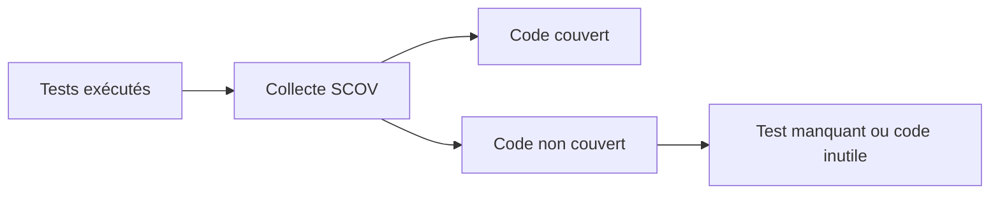

# MESURER LA COUVERTURE AVEC SCOV

## RÉSULTAT ATTENDU

Mesurer quelles parties du code ont réellement été exécutées pendant une campagne de tests.

## Transaction SCOV

`SCOV` permet d’activer la collecte, de définir des groupes et d’afficher la couverture selon les fonctions disponibles sur la release.

## Interprétation

La couverture répond à la question : **ce code a-t-il été exécuté ?** Elle ne répond pas à : **le résultat a-t-il été correctement vérifié ?**



## Utilisations

- identifier des branches non testées ;
- vérifier qu’un scénario de recette traverse le code attendu ;
- repérer du code potentiellement mort ;
- suivre l’évolution d’un périmètre critique.

## Précautions

- activer la collecte selon les règles d’administration ;
- inclure tous les serveurs applicatifs concernés lorsque nécessaire ;
- limiter le périmètre et la durée ;
- ne pas viser mécaniquement 100 % ;
- analyser la qualité des assertions en parallèle.

## Lecture utile

Une branche métier critique non couverte est prioritaire. Une ligne technique sans enjeu peut rester moins importante qu’un test de limite manquant.

## Références SAP officielles

- [SAP Help Portal — Coverage Analyzer](https://help.sap.com/docs/ABAP_PLATFORM_NEW/ba879a6e2ea04d9bb94c7ccd7cdac446/49216c634ab514cde10000000a42189b.html)
- [SAP Help Portal — ABAP Unit](https://help.sap.com/docs/ABAP_PLATFORM_NEW/ba879a6e2ea04d9bb94c7ccd7cdac446/491cfd8926bc14cde10000000a42189b.html)

## PROCESS

### ÉTAPE 1 — DÉFINIR LE PÉRIMÈTRE ET LE SCÉNARIO

Lister classes, programmes ou package à mesurer et les tests censés les couvrir. Définir les cas nominal, limites et erreur. La couverture mesure l’exécution du code, pas la pertinence des assertions.

### ÉTAPE 2 — CRÉER UNE MESURE DANS `SCOV`

Saisir `/nSCOV`, créer ou sélectionner une mesure et renseigner le périmètre selon les fonctions disponibles. Limiter utilisateur et objets pour éviter du bruit. Relever les paramètres de la session.

### ÉTAPE 3 — DÉMARRER LA COLLECTE

Activer la mesure juste avant les tests. Exécuter ABAP Unit puis les scénarios d’intégration prévus sous les utilisateurs inclus. Éviter des activités non liées qui augmenteraient artificiellement la couverture.

### ÉTAPE 4 — ARRÊTER ET OUVRIR LE RÉSULTAT

Désactiver la collecte dès la fin. Afficher la couverture par objet, méthode et branche lorsque disponible. Identifier le code non exécuté important et les chemins seulement couverts par un test sans assertion utile.

### ÉTAPE 5 — AJOUTER DES TESTS CIBLÉS

Créer un test pour chaque branche métier significative non couverte, sans viser mécaniquement 100 %. Si le code est inaccessible ou obsolète, analyser sa suppression plutôt que d’écrire un test artificiel.

### ÉTAPE 6 — REJOUER ET ÉVALUER LA QUALITÉ

Relancer la même mesure et comparer. Vérifier que les nouveaux tests échouent quand la règle est rompue. Conserver couverture, scénarios et limites connues dans la preuve de non-régression.

## VÉRIFICATION

- Le résultat fonctionnel est identique avant et après optimisation.
- La mesure est répétée avec le même jeu de données et le même contexte.
- Les contrôles statiques ne retournent plus de finding bloquant.
- Les tests automatiques couvrent les cas nominal, limites et erreurs attendues.

## ERREURS FRÉQUENTES

- Optimiser sans mesure de référence.
- Accepter un finding critique sans correction ni justification formelle.

## FICHE DE CONTRÔLE À COPIER

```text
Système / SID       :
Mandant             :
Utilisateur         :
Transaction / outil :
Objet technique     :
Jeu de données      :
Résultat attendu    :
Résultat observé    :
Horodatage          :
Ordre de transport  :
```

## TERMES DU LEXIQUE

- [ATC](<../🧩 00 ├── LEXIQUE SAP ET ABAP/10 └── ACRONYMES SAP.md#acro-atc>)
- [ABAP](<../🧩 00 ├── LEXIQUE SAP ET ABAP/10 └── ACRONYMES SAP.md#acro-abap>)
- [Trace](<../🧩 00 ├── LEXIQUE SAP ET ABAP/08 ├── EXECUTION EXPLOITATION ET ADMINISTRATION.md#trace>)
