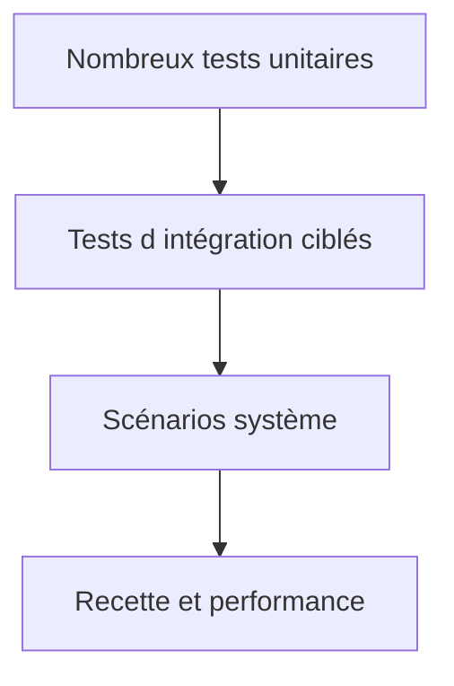

# STRATEGIE DE TEST ET NON REGRESSION

## RÉSULTAT ATTENDU

Organiser les tests selon leur portée, leur coût et le risque couvert.

## Niveaux de test

| Niveau      | Cible                       | Exemple                             |
| ----------- | --------------------------- | ----------------------------------- |
| Unitaire    | méthode ou classe isolée    | calcul, validation, mapping         |
| Intégration | collaboration de composants | accès DDIC, module fonction, BAPI   |
| Système     | processus technique complet | job, interface fichier, transaction |
| Recette     | besoin métier               | scénario validé par le fonctionnel  |
| Performance | temps, volume, concurrence  | charge batch représentative         |



## Construire la non-régression

À chaque correction de défaut :

1. reproduire le défaut ;
2. créer un test qui échoue ;
3. corriger le code ;
4. vérifier que le test réussit ;
5. conserver le test dans la suite.

## Données de test

Elles doivent être minimales, compréhensibles et indépendantes du système lorsque le niveau de test le permet. Pour les tests d’intégration, définir clairement le client, les prérequis, le nettoyage et l’idempotence.

## Couverture du risque

Prioriser les règles financières, autorisations, conversions d’unité, dates, arrondis, reprise après erreur, concurrence et volumes importants. Le nombre de tests n’est pas un objectif autonome.

## Références SAP officielles

- [SAP Help Portal — ABAP Unit](https://help.sap.com/docs/ABAP_PLATFORM_NEW/ba879a6e2ea04d9bb94c7ccd7cdac446/491cfd8926bc14cde10000000a42189b.html)
- [SAP Help Portal — Coverage Analyzer](https://help.sap.com/docs/ABAP_PLATFORM_NEW/ba879a6e2ea04d9bb94c7ccd7cdac446/49216c634ab514cde10000000a42189b.html)
- [SAP Help Portal — ATC Quality Checking](https://help.sap.com/docs/ABAP_PLATFORM_NEW/c238d694b825421f940829321ffa326a/4ec1a1126e391014adc9fffe4e204223.html)

## PROCÉDURE PAS À PAS

1. Lire la définition et identifier les prérequis du chapitre.
2. Choisir un objet Z ou un scénario de démonstration sans impact métier.
3. Reproduire l’exemple dans un système de développement et relever les données d’entrée.
4. Contrôler la syntaxe ou la configuration avant activation/exécution.
5. Comparer le résultat observé avec la section **Vérification**.
6. Documenter toute différence liée à la release, aux autorisations ou au paramétrage du système.

## VÉRIFICATION

- Le résultat fonctionnel est identique avant et après optimisation.
- La mesure est répétée avec le même jeu de données et le même contexte.
- Les contrôles statiques ne retournent plus de finding bloquant.
- Les tests automatiques couvrent les cas nominal, limites et erreurs attendues.

## ERREURS FRÉQUENTES

- Optimiser sans mesure de référence.
- Accepter un finding critique sans correction ni justification formelle.

## FICHE DE CONTRÔLE À COPIER

```text
Système / SID       :
Mandant             :
Utilisateur         :
Transaction / outil :
Objet technique     :
Jeu de données      :
Résultat attendu    :
Résultat observé    :
Horodatage          :
Ordre de transport  :
```

## TERMES DU LEXIQUE

- [ATC](<../🧩 00 ├── LEXIQUE SAP ET ABAP/10 └── ACRONYMES SAP.md#acro-atc>)
- [ABAP](<../🧩 00 ├── LEXIQUE SAP ET ABAP/10 └── ACRONYMES SAP.md#acro-abap>)
- [Trace](<../🧩 00 ├── LEXIQUE SAP ET ABAP/08 ├── EXECUTION EXPLOITATION ET ADMINISTRATION.md#trace>)
